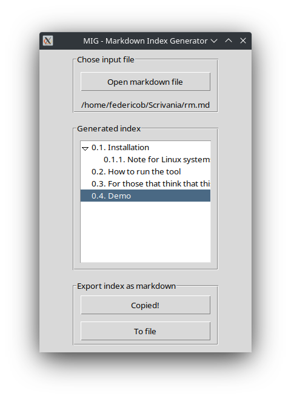

# MIG - Markdown Index Generator

Simple tool to generate indexes for markdown files from their headings.



## Index
1. [Installation](#installation)
    1. [Note for Linux systems](#note-for-linux-systems)
2. [How to run the tool](#how-to-run-the-tool)
3. [For those that think that this is nothing special](#for-those-that-think-that-this-is-nothing-special)
4. [Demo](#demo)


## Installation
Two things are needed:
1. The ```mig.pyw``` file from this repository;
2. A [Python 3 interpreter](https://www.python.org/).

### Note for Linux systems
On some platforms (e.g. some linux distros) you may need to install the ```tkinter``` module.
If you are on an Ubuntu-based distro, the following command should do the job:
```
sudo apt-get install python3-tk
```

## How to run the tool
Run this command:
```
python3 main.pyw
```
On Windows you can also (usually) double click on a ```mig.pyw``` to run the tool.

## For those that think that this is nothing special
They are right. It was born in a stormy night to make my life easier when dealing with GitHub README files (both in spare time and on my workplace).
Look at it for what it is: a hundred-ish lines of code tool that may be useful to some degree to automate a boring repo documentation task.

## Demo
The index of this README is made with MIG. That's all the demo that you need (beside trying it yourself).
